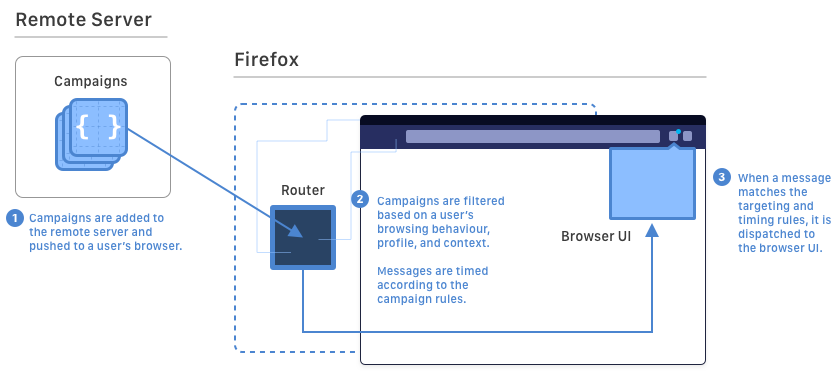

# [Draft Proposal] Firefox Message Router

The Firefox Message Router is a system for dispatching smart, in-product communications in a way that supports our core Mozilla values around user attention and interuptions. Some examples include:

* A recommendation to use pinned tabs for users that frequently use gmail
* A recommendation to install the React devtools addon when a user is browsing the React docs
* An onboarding message about how to use our new tracking protection tools 48 hours after a user has installed the browser

## A model for responsible user engagement

Like we care deeply about protecting our users' data and privacy, we should also protect their time, attention, and vulnerability to interuption. Our team uses a model of understanding the impact of different kinds of interuptions – much like the data team classifies telemetry into levels – so that we can handle messages with an appropriate level of care while also maximizing effectiveness.

Part of this strategy is making sure we have the right targeting, timing, and user preferences so that messages can be shown only when they are the most effective and relevant to users who care about them, which is where the **Message Router** comes in.

## Features and benefits

### Robust UI, targeting, and timing without the engineering effort

When you create a **Campaign** (i.e. something you are trying to communicate to users), you benefit from the following features:

* **UI**: You can choose from a variety of "Message Types", each of which has a list of configurable templates and components (e.g. door-hangers, badges) that require no additional code. Templates are optimized for localization and accessibility.

* **Targeting**: You choose which users should see your messages based on their behaviour (e.g. browsing history, devtools usage, number of devices), characteristics (e.g. locale, profile age, country), or context (e.g. when a user opens devtools for the first time)

* **Timing**: You can choose the start and end times of the campaign (e.g. Black Friday). Your message will be coordinated with other messages of the same type and limited by our frequency capping mechanism so that users have multiple opportunities to see your message, but not too often.

* **User preferences**: We have built-in support for users to "snooze" or turn off notifications either by message, type, category.

Combined with **built-in support for Telemetry and Firefox Experiments integration**, this will allow you to maximise the effectiveness of your campaign while minimizing annoyance and potential harm to users.

### Off-train release cadence

Campaigns and their definitions can be updated and adjusted using our Submission Process, which allows for secure off-train updates via Remote Settings. This will allow you to run experiments and respond to feedback from telemetry faster, without managing the overhead of uplifts or add-on studies.

## Technical documentation

* [Campaign Lifecycle](./docs/campaign-lifecycle.md)
  * How do I create a campaign?
  * How are campaigns approved and deployed?
* [Standard Message Format](./docs/smf-json.md)
